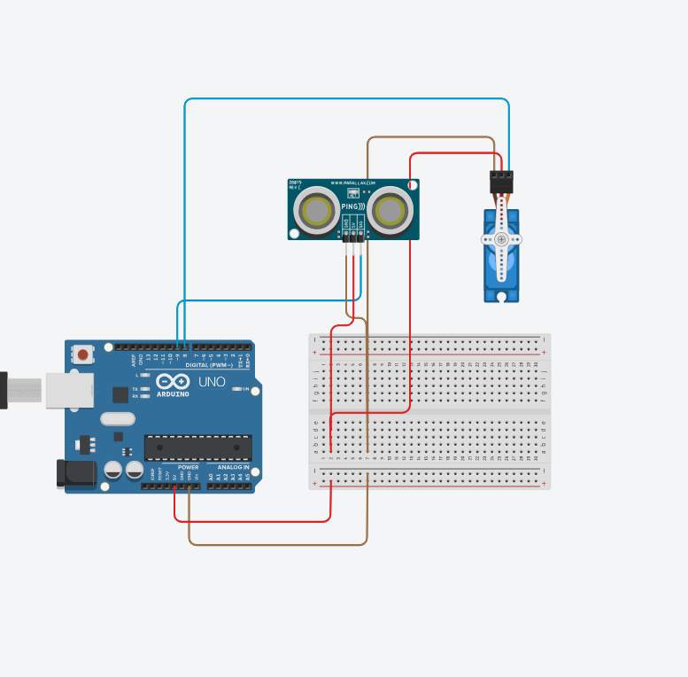

### 아두이노 기반 미니 프로젝트

[진행 방향]
Python으로 fake 데이터를 활용하여 시리얼 통신 구조 제작
아두이노 및 센서를 활용하여 실제 데이터 수집(시리얼 통신 구조 재사용)
좌표 변환 및 matplotlib 2D 맵핑.

[사용 환경]
개발 툴 : Visual Studio Code (Python)
라이브러리 : pyserial, matplotlib, math
- pyserial(아두이노와 Python 간 시리얼 통신 담당)
- matplotlib(센서 데이터를 시각화해서 2D 맵핑 확인)
- math(좌표 변환)

[코드]
- [data_source.py](https://github.com/sgayoung129/SLAM-Arduino-Unity-Simulation/blob/main/Arduino/data_source.py)
  ⇢ 가상 데이터 또는 시리얼 입력 데이터를 관리
- [utils.py](https://github.com/sgayoung129/SLAM-Arduino-Unity-Simulation/blob/main/Arduino/utils.py)
  ⇢좌표 변환 및 데이터 처리 함수 모음  
- [main.py](https://github.com/sgayoung129/SLAM-Arduino-Unity-Simulation/blob/main/Arduino/main.py)
 ⇢ 전체 실행 파일 (시리얼 수신 -> 좌표 변 -> 2D 맵핑)

[하드웨어]
Arduino UNO : 전체 시스템을 제어하는 마이크로 컨트롤러 보드
초음파 센서(HC-SR04) : 거리 측정을 위한 센서 (장애물까지의 거리 데이터)
서보 모터(SG90) : 초음파센서를 회전시켜 각도별 거리 측정 가능
Breadvoard & Jumper Wires : 센서 및 모터 배선을 간단히 연결하기 위한 실습용 도구

[회로도]

